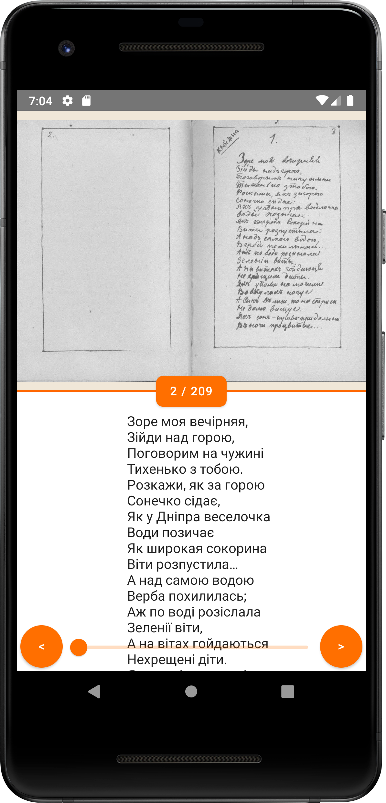
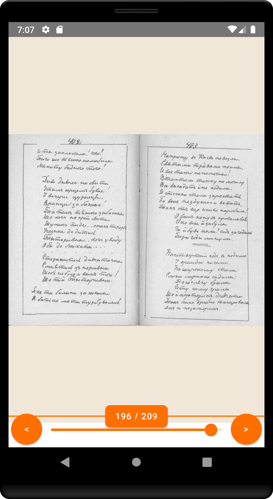
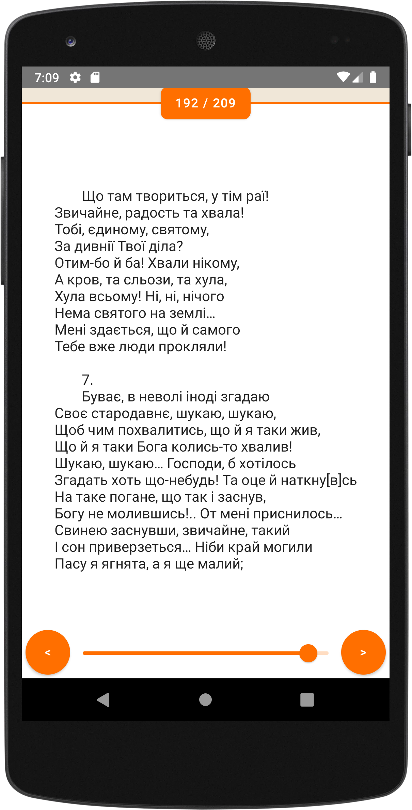
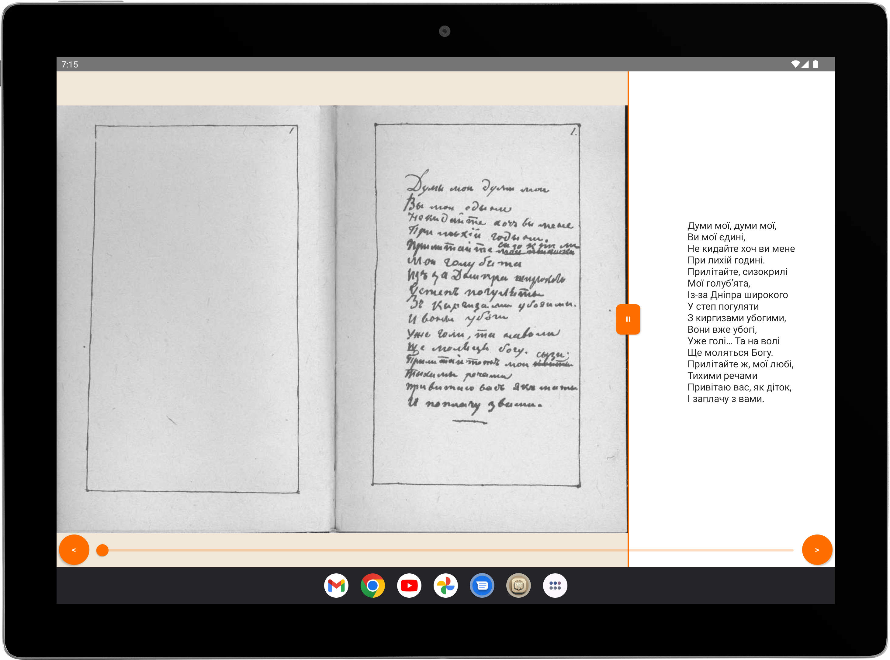

[](https://stand-with-ukraine.pp.ua)
[](https://github.com/Turskyi/MalaKnyzhka/actions/workflows/android_compose_ci.yml)
[](https://github.com/Turskyi/MalaKnyzhka/actions/workflows/firebase-hosting-pull-request.yml)
[](https://github.com/Turskyi/MalaKnyzhka/actions/workflows/firebase-hosting-merge.yml)
[](https://codemagic.io/apps/678d89827cdba5cbbb772f7a/android-compose-multiplatform-workflow/latest_build)


# Мала Книжка (Тарас Шевченко)

Welcome to "Мала Книжка (Тарас Шевченко)," a Compose Multiplatform project
designed to deliver a cohesive reading experience across Android, iOS, Web, and
Desktop. This project aims to celebrate the lyrical beauty of Taras Shevchenko's
poetry.

### Testing the App:

Join our testing program and provide valuable feedback:

- [Android App Distribution Tester Invite](https://appdistribution.firebase.dev/i/598cf84a44dfa4de)

## PROJECT SPECIFICATION

• Programming language: [Kotlin](https://kotlinlang.org/);

•
Framework: [Compose Multiplatform](https://www.jetbrains.com/lp/compose-multiplatform/);

• SDK: [Kotlin Multiplatform](https://kotlinlang.org/docs/multiplatform.html);

• Interface: [Compose](https://developer.android.com/jetpack/compose);

• Version control system: [Git](https://git-scm.com);

• Git Hosting Service: [GitHub](https://github.com);

• **Code Readability:** code is easily readable with no unnecessary blank
lines, no unused variables or methods, and no commented-out code, all
variables, methods, and resource IDs are descriptively named such that another
developer reading the code can easily understand their function.

• Architectural pattern:
[Monolith](https://learn.microsoft.com/en-us/dotnet/architecture/modern-web-apps-azure/common-web-application-architectures#all-in-one-applications);

## Project Structure

- **`/composeApp`**: Contains shared code for the Compose Multiplatform
  applications.

  - **`commonMain`**: Houses the common code for all targets.
  - **Platform-specific folders** (e.g., `iosMain`, `androidMain`): These
    contain code for specific platforms like CoreCrypto for iOS in the
    `iosMain` folder.

- **`/iosApp`**: Contains the iOS applications. Despite sharing UI code, this
  serves as the entry point for the iOS app and can include Swift/SwiftUI code
  if needed.

## About the Project

### Overview

"Мала Книжка (Тарас Шевченко)" is a digital collection of Taras Shevchenko's
works, offering a seamless reading experience with draggable dividers and
elegant page transitions. It supports multiple platforms through Compose
Multiplatform, sharing a unified codebase.

### Features

- **Platform Support**: A single codebase approach for Android, iOS, Web, and
  Desktop.
- **Interactive UI**: Draggable dividers allowing users to switch between text
  and images effortlessly.
- **Swipe Gestures**: Smooth page transitions with horizontal drag gestures.
- **Multilingual Support**: Access Shevchenko's poetry in its native language.
- **Authentic Scans**: Includes scanned book spreads of the original "Мала
  Книжка" with the actual handwriting of Taras Shevchenko, offering a glimpse
  into the early Ukrainian language and script.

## Credits

This project utilizes book spreads and texts from the website
[t-shevchenko.name](https://www.t-shevchenko.name/uk/Gallery/Works/1850MalaKn.html).
The site's creators kindly allow reproduction with proper referencing. \*
\*Передрук статей із сайту заохочується за умови посилання (гіперпосилання) на
наш сайт\*\*. Many thanks for their valuable contributions.

## Getting Started

To get started, ensure you have the necessary development environments for each
target platform. For detailed guidelines, refer to the following:

- [Kotlin Multiplatform](https://www.jetbrains.com/help/kotlin-multiplatform-dev/get-started.html)
- [Compose Multiplatform](https://github.com/JetBrains/compose-multiplatform/#compose-multiplatform)
- [Kotlin/Wasm](https://kotl.in/wasm/)

### Building and Running the Project

Build and run the web application using this Gradle task:

```bash
./gradlew :composeApp:wasmJsBrowserDevelopmentRun
```

## How to Contribute

We welcome contributions to enhance this project. Here&#39;s how you can
contribute:

- **Report Issues**: Encountered a bug or have a suggestion? Report issues
  on [GitHub](https://github.com/JetBrains/compose-multiplatform/issues).

Enjoy the poetic journey! 🌟

## Screenshots:

<!--suppress CheckImageSize -->

<!--suppress CheckImageSize -->

<!--suppress CheckImageSize -->

<!--suppress CheckImageSize -->


## Download

<a href="https://play.google.com/store/apps/details?id=com.turskyi.malaknyzhka" target="_blank">

</a>
